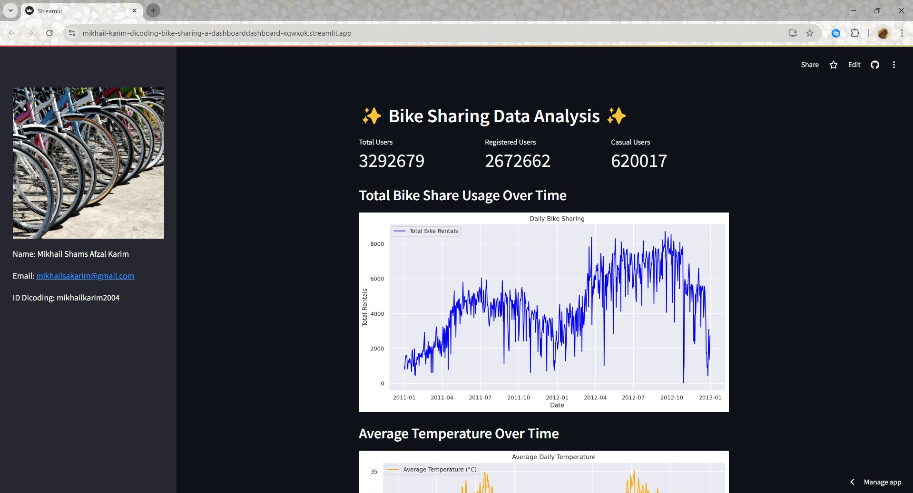

# ✨ Bike Sharing Data Analytics Dashboard ✨



## Description
This is the github repository of my dicoding final project course "Belajar Data Analisis dengan Python".

## Prerequisite
Required libraries:
- numpy
- pandas
- matplotlib
- seaborn
- streamlit

## Setup Environment
```
git clone https://github.com/mikhail-karim/dicoding-bike_sharing_analysis-submission.git
pip install -r requirements.txt
```
or
```
pip insall numpy pandas matplotlib seaborn streamlit
```

## Run steamlit app
```
cd dashboard
streamlit run dashboard.py
```

## Enjoy!